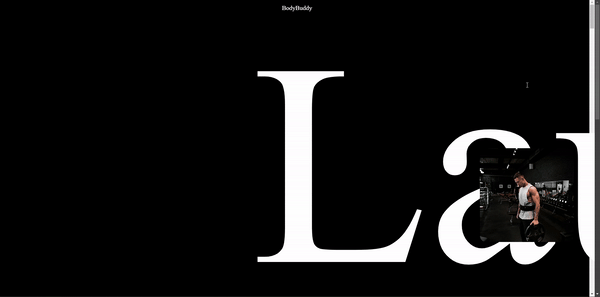

# Parallax Playground

A  repository that showcases a collection of  parallax effects created using HTML,CSS and JS. This repository serves as a playground for web developers and designers, offering an array of examples that demonstrate parallax scrolling. Whether you're a beginner seeking inspiration or an experienced developer looking to enhance your design arsenal, "Parallax Playground" is a go-to resource for unlocking the full potential of parallax in HTML,CSS and JS.

## Product 1 Demo

 

**Made using : https://www.youtube.com/watch?v=1wfeqDyMUx4** 

## Product 2 Demo

  

**Made using : https://www.youtube.com/watch?v=TUD9999TbS0** 

## Product 3 Demo

  

**Made using : https://www.youtube.com/watch?v=Ecy-xsBqCcQ** 

## Product 4 Demo

  

**Made using : https://www.youtube.com/watch?v=VB1U1yV3vl4** 

## Product 5 Demo

  

**Made using : https://www.youtube.com/watch?v=k9LyMwSq5jM** 